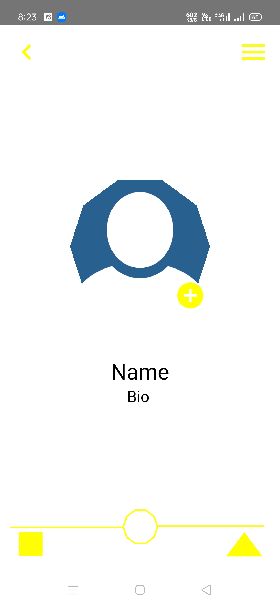
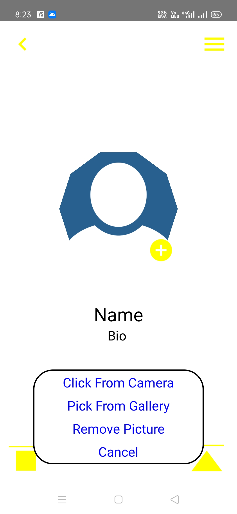
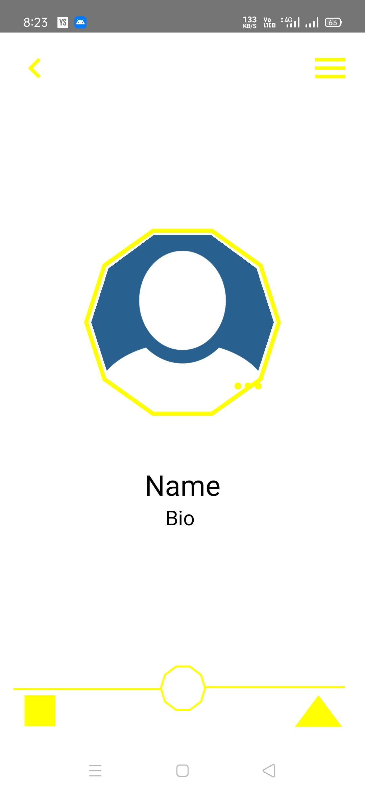
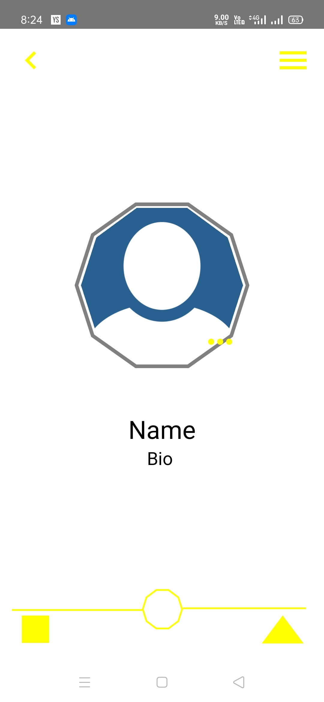

# Sample_UI_App
<figure>
  
  <figcaption style={align:center}>No Story</figcaption>
</figure>
<figure>
  
  <figcaption style={align:center}>Edit Profile</figcaption>
</figure>
<figure>
  
  <figcaption style={align:center}>Story Added</figcaption>
</figure>
<figure>
  
  <figcaption style={align:center}>Story</figcaption>
</figure>
<figure>
  
  <figcaption style={align:center}>Story Viewed</figcaption>
</figure>

